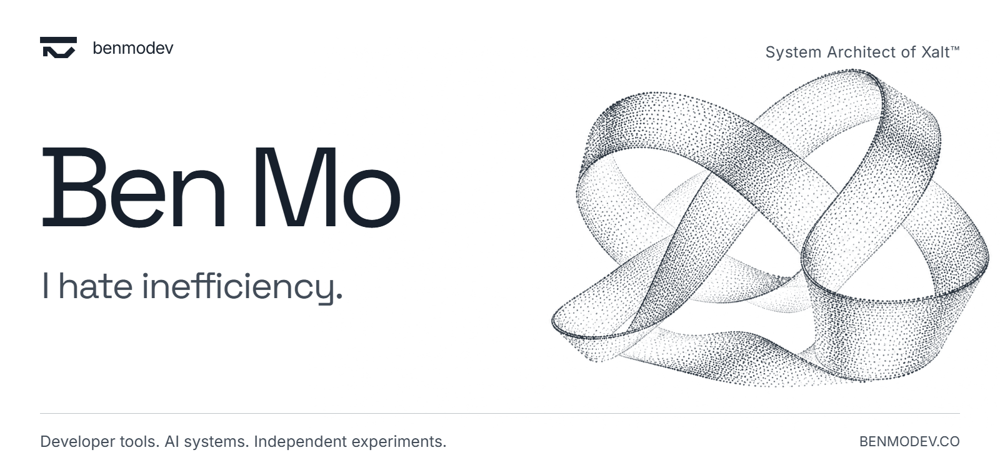
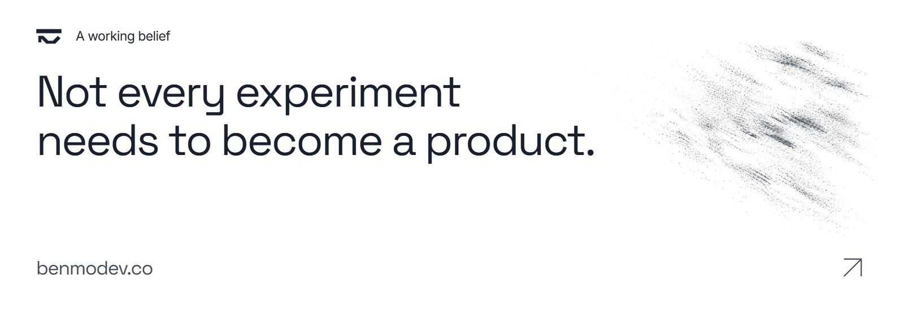

<a href="https://benmodev.co">
  <picture>
    <source media="(prefers-color-scheme: dark)" srcset="assets/benmo-particles-dark.png">
    <source media="(prefers-color-scheme: light)" srcset="assets/benmo-particles-light.png">
    
  </picture>
</a>

  <strong><a href="https://benmodev.co/work/xalt#waitlist">Join the Xalt waitlist ↗</a></strong>

  <a href="https://benmodev.co">Portfolio</a> &nbsp; / &nbsp;
  <a href="#selected-work">Selected work</a> &nbsp; / &nbsp;
  <a href="https://benmodev.co/contact">Contact</a>

<strong>How I work</strong> · Architecture, assumptions and constraints

### System Architect of Xalt™

When something is slow, awkward or needlessly complicated, I want to understand why. I follow a problem back to its assumptions, constraints and dependencies, then work through the architecture. My projects span developer tools, AI systems and independent experiments.

## Selected work

  <strong>Xalt · In development · Architecture and current limits</strong>
  <picture>
    <source media="(prefers-color-scheme: dark)" srcset="assets/xalt-summary-dark.png">
    <source media="(prefers-color-scheme: light)" srcset="assets/xalt-summary-light.png">
    
  </picture>

<a href="https://benmodev.co/work/xalt">
  <picture>
    <source media="(prefers-color-scheme: dark)" srcset="assets/xalt-particles-dark.png">
    <source media="(prefers-color-scheme: light)" srcset="assets/xalt-particles-light.png">
    
  </picture>
</a>

### Xalt

An attempt to build one iOS app on Windows became a development environment. Xalt keeps local Swift iteration and a bounded preview on Windows, then uses genuine Xcode for Apple builds and verifies the returned artifacts. The architecture follows the boundary between those two environments.

**In development** · Code private today · Open-source release planned

  <strong><a href="https://benmodev.co/work/xalt#waitlist">Join the Xalt waitlist ↗</a></strong>
  &nbsp; / &nbsp;
  <a href="https://benmodev.co/work/xalt">Read the origin and architecture ↗</a>

#### Inside the development loop

- **Iterate on Windows.** A Swift toolchain, local runtime and preview provide the everyday feedback loop.
- **Coordinate through shared tools.** The IDE, CLI and MCP interface use one operation engine.
- **Build with Xcode.** A frozen job carries the source into a genuine Apple environment.
- **Verify what returns.** Artifacts and their evidence are checked on Windows against the prepared job.

The local preview is bounded and is not Apple Simulator. Apple build and distribution requirements still apply. Release timing and the open-source licence remain to be announced.

  <strong>Xalt Agents · Ongoing research · Evidence so far</strong>
  <picture>
    <source media="(prefers-color-scheme: dark)" srcset="assets/xalt-agents-summary-dark.png">
    <source media="(prefers-color-scheme: light)" srcset="assets/xalt-agents-summary-light.png">
    
  </picture>

<a href="https://benmodev.co/work/xalt-agents">
  <picture>
    <source media="(prefers-color-scheme: dark)" srcset="assets/xalt-agents-particles-dark.png">
    <source media="(prefers-color-scheme: light)" srcset="assets/xalt-agents-particles-light.png">
    
  </picture>
</a>

### Xalt Agents

A preview can look convincing and still leave important questions unanswered. Xalt Agents uses AI to propose Swift tests, deterministic checks to preserve their identity, and Apple's tools to observe the results. The research is building the reference evidence needed to understand Xalt's limits.

**Ongoing research** · Closed source

<a href="https://benmodev.co/work/xalt-agents">Explore the research and its current evidence ↗</a>

#### What the evidence currently establishes

The pipeline has produced compiler evidence and bounded hosted runtime, frame and accessibility observations. Apple reference acquisition remains partial; differential comparison against Xalt has not started. An accepted test is not an overall compatibility score.

Every result stays connected to its exact input. Compiler rejection and an infrastructure failure remain different outcomes.

<a href="https://benmodev.co/#about">
  <picture>
    <source media="(prefers-color-scheme: dark)" srcset="assets/working-belief-particles-dark.png">
    <source media="(prefers-color-scheme: light)" srcset="assets/working-belief-particles-light.png">
    
  </picture>
</a>

  <a href="https://benmodev.co">benmodev.co</a> &nbsp; / &nbsp;
  <a href="https://x.com/benmodev">X</a> &nbsp; / &nbsp;
  <a href="mailto:hello@benmodev.co">hello@benmodev.co</a>

